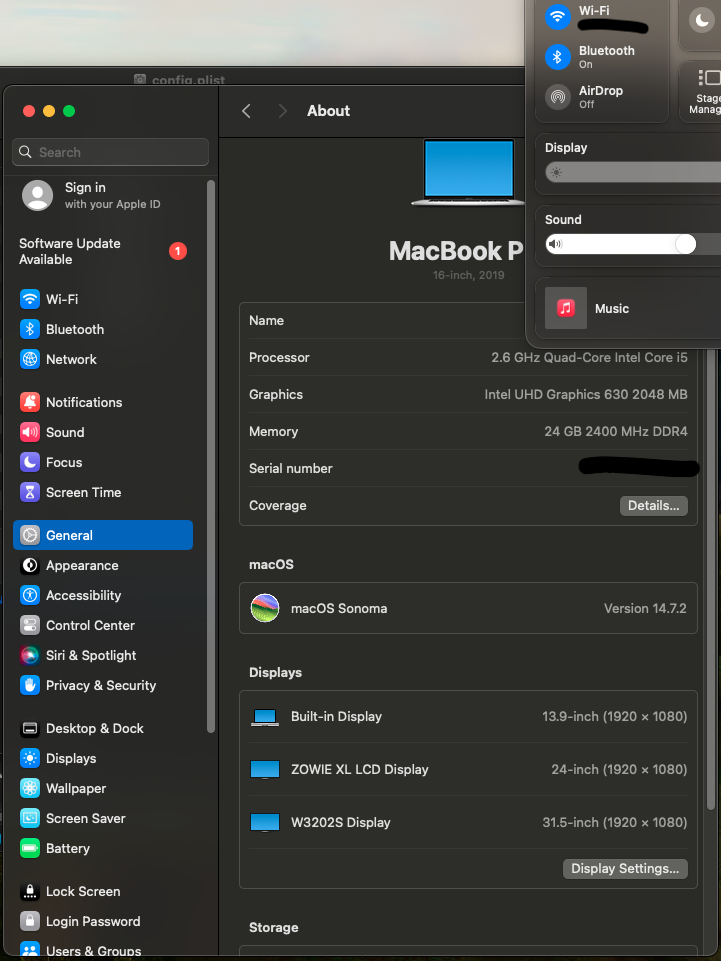
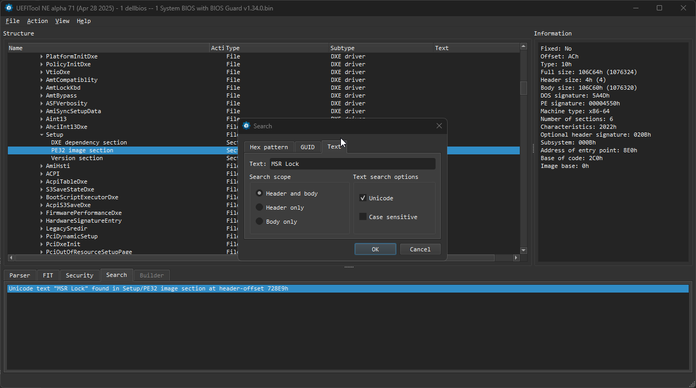
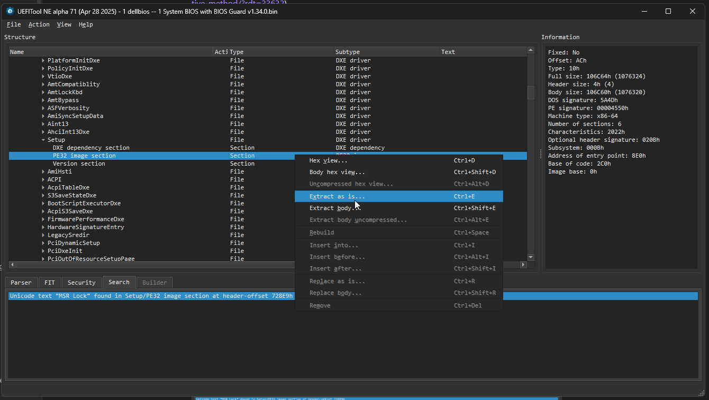

# OpenCore (1.0.4) Configuration for For Dell Latitude 5411 with MacOs Sonoma with Intel Bluetooth/wifi

> All the work was based on [Latitude 5411 for yosemite repo](https://github.com/MokkaSchnalle/macOS-Dell-5411-5511)

## Table of Contents
- [About This EFI](#about-this-efi)
- [Change Bios Locked settings](#change-bios-locked-settings)
- [Hardware Specifications](#hardware-specifications)
- [macOS Version Supported](#macos-version-supported)
- [What's Working](#whats-working)
- [What's Not Working / Known Issues](#whats-not-working--known-issues)
- [Installation](#installation)
- [BIOS Settings](#bios-settings)
- [Post-Installation](#post-installation)
- [Updating OpenCore and Kexts](#updating-opencore-and-kexts)
- [Credits](#credits)
- [Disclaimer](#disclaimer)


## About This EFI

This EFI is configured for the Dell Latitude 5411 running macOS Sonoma. It aims for a stable and functional Hackintosh experience.

## Change Bios Locked settings 

this part was based on the repo above, as search on the internet for missing part that are not explained enough

`git clone https://github.com/platomav/BIOSUtilities/`

pip install -r requirements.txt

` python .\main.py "..\dellbios5x11v1.34.exe" --output-dir "..\dell_extract" `

they file were extracted
they did extract files, as show in the title of open program, i did open '1 dellbios -- 1 System BIOS with BIOS Guard v1.34.0.bin', after that i searched for 'MSR Lock' (old name CFG Lock 😤, thanks to a reddit post https://www.reddit.com/r/hackintosh/comments/hz2rtm/cfg_lockunlocking_alternative_method/?rdt=33632), 



i did right click on it, and Extract as is..., you will get the `.sct` file , at least in my case



than you can proceed with ifrextractor `https://github.com/LongSoft/IFRExtractor-RS`

i did try to follow `https://github.com/MokkaSchnalle/macOS-Dell-5411-5511` but a lot has changed from then

basically i got this 

from line 28 we pick the Name "SaSetup" using VarStoreId: 0x16 from 17756 (we also get VarOffset: 0xF5)

using setup_var.efi version 0.3 (already included in EFI folder, under EFI\OC\Drivers)

### Step to run the commands

1. Boot of USbDrive (that have OpenCore of the Efi partition)
2. Open openshell.efi (from the showing element)
3. Type `FS0:` than `enter` key(you might need to change if your efi partition is another)
4. Run `cd EFI\OC\Drivers`
5. Change DVMT pre allocated from default (32M) to 0x2  (64M)
```Bash
setup_var.efi SaSetup:0xF5=0x2 
```
6. Disable MRS(CFG) Lock
```Bash
setup_var.efi CpuSetup:0x2B=0x0
```


## Hardware Specifications

| Component        | Model                                     | Notes                                     |
|------------------|-------------------------------------------|-------------------------------------------|
| CPU              | e.g., Intel Core i5-10400h                 |                                           |
| GPU              | e.g., Intel UHD Graphics 630              |                                           |
| RAM              | e.g., 16GB DDR4 2400MHz                   |                                           |
| Motherboard Model| e.g., Dell Latitude 5411                  |                                           |
| Audio Codec      | e.g., Realtek ALC256 (ALC3204)            |                                 |
| Ethernet         | e.g., Intel I219-LM                       |                                           |
| Wi-Fi & Bluetooth| e.g., Intel AX201 | Apple did rework the network stack in sonoma, so that's why we will not Apple feature handoff or AirDrop but you can try on your own,     |
| Touchpad         | e.g., Alps I2C ALPS Touchpad               |                                           |
| Storage          | e.g., Kingston A2000 500GB NVMe SSD |                                           |
| Screen           | e.g., 14-inch Full HD (1920x1080)         |                                           |
| Other Peripherals| e.g., Webcam, SD Card Reader              |                  |

## macOS Version Supported
- macOS Sonoma 14.7
- ...

## What's Working
List all the hardware and features that are functioning correctly.
- [x] Intel UHD Graphics 630 QE/CI
- [x] Audio (Internal Speakers, Headphone Jack)
- [x] Microphone
- [x] Ethernet
- [x] Wi-Fi
- [x] Bluetooth
- [x] USB Ports (USB 2.0, USB 3.0, Type-C)
- [x] Internal Webcam
- [x] Touchpad (with gestures)
- [x] Keyboard (including backlight if applicable)
- [x] Battery Management
- [x] Brightness Control


## What's Not Working / Known Issues
List any hardware or features that are not working or not tested enough
- [ ] CPU Power Management (not sure how to test it)
- [ ] Sleep / Wake (not working, but not sure)
- [ ] e.g., SD Card Reader (not tested)
- [ ] iMessage, FaceTime, App Store, iCloud
- [ ] AirDrop, Handoff, Continuity (if applicable with your Wi-Fi/BT card)
- [ ] Fingerprint reader
- ...

## Installation
1.  **Create a macOS USB Installer:** Follow the [Dortania OpenCore Install Guide](https://dortania.github.io/OpenCore-Install-Guide/installer-guide/) to create your USB installer.
2.  **Clone this Repository:** `git clone [URL_OF_YOUR_REPO]` or download the ZIP.
3.  **Copy EFI Folder:** Copy the `EFI` folder from this repository to the EFI partition of your USB installer.
4.  **Generate SMBIOS:** Use [GenSMBIOS](https://github.com/corpnewt/GenSMBIOS) to generate a unique SMBIOS for your system (e.g., `MacBookPro15,2` or an appropriate model for your hardware). Update your `config.plist` (PlatformInfo > Generic) with these values. **This step is crucial for Apple services.**
5.  **BIOS Settings:** Configure your BIOS settings as per the [BIOS Settings](#bios-settings) section below.
6.  **Install macOS:** Boot from the USB drive and install macOS.
7.  **Post-Installation:** After installation, mount the EFI partition of your system drive and copy the `EFI` folder from your USB to it.

## BIOS Settings

*   Secure Boot: Off (Default: On)
*   SATA Mode: AHCI (Default: RAID) (Also includes NVMe drives! macOS will not see any drives when using RAID mode)
*   Intel SGX: Software Controlled or Off
*   Thunderbolt Configuration: No Security


## Post-Installation
-   Mount your system's EFI partition.
-   Copy the EFI folder from your USB stick (which you've configured and tested) to the EFI partition of your main drive.
-   Generate new SMBIOS information if you haven't already and update your `config.plist`.
-   Consider any other system-specific tweaks or configurations.

## Updating OpenCore and Kexts
1.  Download the latest version of OpenCorePkg from [Acidanthera's GitHub](https://github.com/acidanthera/OpenCorePkg/releases).
2.  Update the necessary files (`BOOTx64.efi`, `OpenCore.efi`, `Drivers`, etc.) in your `EFI/OC` folder.
3.  Download the latest versions of your kexts (Lilu, WhateverGreen, VirtualSMC, AppleALC, etc.) from their respective repositories (usually found on Acidanthera's GitHub or Dortania's kexts page).
4.  Replace the old kexts in your `EFI/OC/Kexts` folder.
5.  Review the OpenCore release notes and the `Sample.plist` for any new or changed settings in `config.plist` and update your `config.plist` accordingly. Using a tool like [OCAuxiliaryTools (OCAT)](https://github.com/ic005k/OCAuxiliaryTools) can help with this.
6.  **Always back up your working EFI before making changes.**

## Credits
*   [Apple](https://www.apple.com) for macOS.
*   [Acidanthera](https://github.com/acidanthera) for OpenCore and many essential kexts.
*   [Dortania](https://dortania.github.io/OpenCore-Install-Guide/) for the comprehensive OpenCore Install Guide.
*   [CorpNewt](https://github.com/corpnewt) for tools like GenSMBIOS and ProperTree.
*   [RehabMan](https://github.com/RehabMan) for his pioneering work in the Hackintosh community.
* [Dell-latitude-5411 openCore Monterey](https://github.com/MokkaSchnalle/macOS-Dell-5411-5511) 
*   Any other specific guides, forums, or individuals who helped you.

## Disclaimer
This EFI is provided as-is. While it has been tested on the specified hardware, I am not responsible for any damage or data loss that may occur. Use at your own risk. Always back up your data before proceeding.